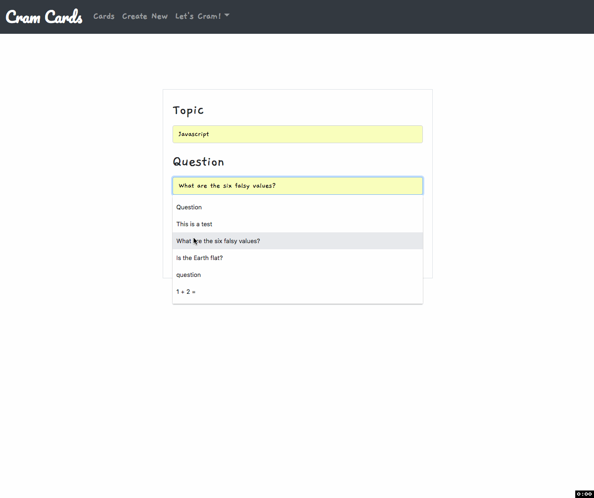

# react flash cards

[https://franzsalvador.github.io/react-flash-cards/](https://franzsalvador.github.io/react-flash-cards/)

A React.js application for self-learners who want to expand their knowledge.

## Technologies Used
- React
- Javascript
- HTML5
- CSS3
- Bootstrap

## Key Features

### Create, edit, practice, study and record failed and correct attempts.


Clone the repository.
```
git clone https://github.com/franzsalvador/react-flash-cards
```

Install dependencies.
```
npm install
```

### Run the app.
```
npm run watch
```
